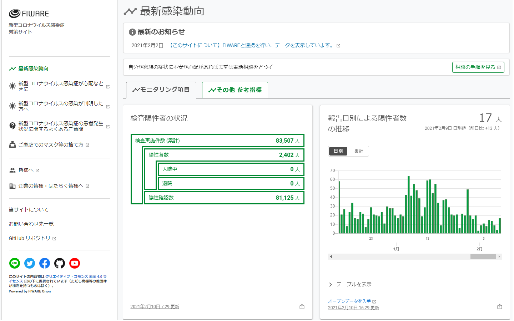
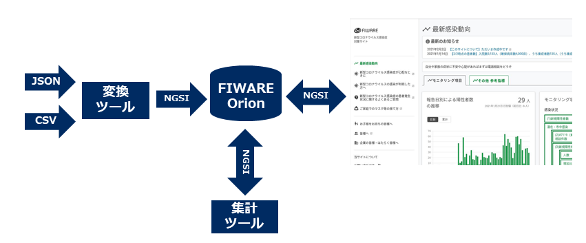

# FIWARE Covid-19

FIWARE Covid-19 は、自治体等が公開する新型コロナウイルス感染症対策のオープンデータを NGSI v2 形式のデータに変換し、Web サイトに表示するソフトウェアです。
[変換ツール](./converter/README.md)、[集計ツール](./aggregator/README.md)、[Webサイト](./docker/README.md)の３つのソフトウェア部品で構成されており、Docker コンテナで実行できます。



## 利用方法

利用方法は、次の通りです。

### リポジトリのクローン

git コマンドを使用してリポジトリをクローンします。

```console
git clone https://github.com/NEC-FIWARE/fiware-covid-19.git
cd fiware-covid-19
```

### Web サイト起動

新型コロナウイルス感染症対策のオープンデータを取得して、Web サイトを起動します。
`start.sh` を実行することで、Docker コンテナ イメージのビルドとオープンデータの取り込み、Weｂ サイト起動を一括で行います。サーバは開発モードで起動します。

#### CKAN サイトから CSV 形式のデータを取得する例 (北九州市)

```console
./start.sh example/401005_kitakyushu/
```

#### API を使用してデータを取得する例 (札幌市)

政府 CIO [オープンデータ API ポータル](https://portal.opendata.go.jp/)の API を使用してデータを取得する例です。
API Key を取得して、環境変数 `NGSI_CONV_APIKEY` にセットして、`start.sh` を実行してください。

```console
export NGSI_CONV_APIKEY=xxxxxxxxxxxxx
./start.sh example/011002_sapporo-shi/
```

### Web サイトへのアクセス

Web サイトはポート 3000 で起動します。Web ブラウザで、このポートにアクセスしてください。
また、Orion Context Broker はポート 1026 で起動します。

### Web サイトの停止

Web サイトの停止は以下を実行してください。

```
./stop.sh
```

## 構成

FIWARE Cvoid-19 の構成は以下の通りです。



## ドキュメント

各ソフトウェア部品およびデータモデルの詳細は、以下を参照ください。

- [変換ツール](./converter/README.md)
- [集計ツール](./aggregator/README.md)
- [Web サイト](./docker/README.md)
- [データモデル](https://github.com/NEC-FIWARE/smart-data-models)

## NGSI-LD (experimental)

実験的に開発途中の FIWARE Orion-LD を Context Broker として利用する例です。Web サイトの表示結果は NGSI v2 のものと同じですが、Context Broker に格納されるデータが NGSI-LD 形式になります。NGSI-LD 版に動作には @context ファイルが必要となります。FIWARE Covid-19 用の @context ファイルは、https://cio-context.fiware-testbed.jp/cio-context.jsonld にあります。これは、NEC × さくらインターネット実証実験で運営しているサイトで、実証実験の終了後にはアクセスできなくなります。したがって、この @context ファイルは永続的なものでないことにご注意ください。

NGSI-LD の例は `example-ld` にあります。NGSI v2 と同様、`start-ld.sh` に `example-ld` 下のディレクトリを指定して、Web サイトを起動できます。Web サイトの停止は `stop-ld.sh` を実行してください。

## 注意

現在、このリポジトリでは、Isuue および Pull Request を受け付けておりません。

## License

Licensed under the [MIT License](./LICENSE).

## Copyright

Copyright (c) 2021 NEC Corporation
